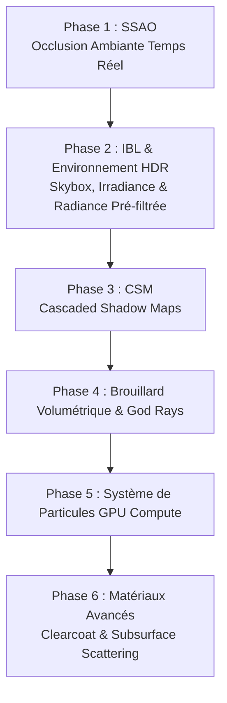

# 🏛️ SPÉCIFICATION TECHNIQUE & ROADMAP MOTEUR 3D PUR (AOR-3D-ENGINE)

> **Document de Référence & Engagements Techniques**  
> Objectif : Élever le cœur du moteur de rendu graphique et physique pur au standard photoréaliste et jeux vidéo AAA (temps réel WebGPU / WGPU).

---

## 📐 1. Socle Existant Validé (Baseline)

| Composant | Statut | Caractéristiques Techniques |
| :--- | :---: | :--- |
| **Pipeline PBR Forward** | ✅ Validé | Cook-Torrance GGX, Fresnel Schlick, Roughness, Metallic, IOR, Transmission, Émission HDR. |
| **Normal Mapping** | ✅ Validé | Tangent-space perturbation avec calcul robuste des tangentes et bitangentes. |
| **Shadow Mapping** | ✅ Validé | Ombre portée directionnelle avec filtrage PCF 3x3 (Percentage-Closer Filtering). |
| **Path Tracer GPU (Compute)** | ✅ Validé | Ray-tracing matériel avec BVH hiérarchique, rebonds multiples, échantillonnage Monte-Carlo. |
| **Post-Processing HDR** | ✅ Validé | Extraction de luminance, Bloom Dual-Kawase 9-taps, ACES Film Tonemapping, Vignettage. |
| **Conteneur Industriel `.aor`** | ✅ Validé | Format hybride Binaire POD (alignement 16 octets) + JSON, mutations in-place, sécurité 6 niveaux. |
| **Suite de Tests** | ✅ 100% | 108/108 tests unitaires et d'intégration validés. |

---

## 🚀 2. Feuille de Route d'Implémentation "Moteur Pur" (Ordre d'Exécution)

---

### 🔹 Phase 1 : SSAO (Screen-Space Ambient Occlusion)
- **Objectif** : Générer des ombres douces de contact dans les creux, recoins et sous les objets pour supprimer l'effet de flottement et ancrer la scène.
- **Détails Techniques** :
  - Génération d'une demi-sphère d'échantillonnage de 16/32 vecteurs de bruit normalisés.
  - Texture de bruit aléatoire 4x4 répétée pour supprimer les motifs réguliers.
  - Calcul de l'occlusion dans l'espace caméra à partir du Depth Buffer et de la normale de surface.
  - Passe de flou bilatéral de lissage pour éliminer le grain sans baver sur les arêtes franches.
  - Injection directe du facteur SSAO dans le calcul de la lumière ambiante du shader standard.

---

### 🔹 Phase 2 : IBL (Image-Based Lighting) & Reflets d'Environnement HDR
- **Objectif** : Donner des reflets réalistes et une lumière ambiante cohérente avec le ciel sur tous les matériaux métalliques et rugueux.
- **Détails Techniques** :
  - Support des Skybox / Cubemaps HDR environnementales.
  - Carte d'Irradiance Diffuse (harmoniques sphériques ou convolution de cubemap).
  - Carte de Radiance Pré-filtrée (Spéculaire par niveau de rugosité / Mipmaps de roughness).
  - Texture de table d'intégration BRDF 2D (LUT pré-calculée).

---

### 🔹 Phase 3 : Cascaded Shadow Maps (CSM)
- **Objectif** : Ombres nettes et détaillées à proximité immédiate de la caméra tout en couvrant les horizons lointains sans aliasing.
- **Détails Techniques** :
  - Découpage du Frustum de caméra en 3 ou 4 tranches de profondeur (cascades).
  - Calcul des matrices de projection orthogonale adaptées à chaque cascade.
  - Tableau de textures de profondeur (`texture_depth_2d_array`) et transition douce entre cascades.

---

### 🔹 Phase 4 : Brouillard Volumétrique & Rayons Crépusculaires (God Rays)
- **Objectif** : Atmosphère dense et vivante (brume nocturne, pluie, faisceaux de lumière et néons volumétriques).
- **Détails Techniques** :
  - Raymarching dans un volume de densité 3D ou passe de post-process guidée par le depth buffer et la matrice de shadow map.
  - Phase d'Henyey-Greenstein pour la diffusion lumineuse avant/arrière (Mie scattering).

---

### 🔹 Phase 5 : Moteur de Particules GPU (Compute Shader)
- **Objectif** : Simulation de 100 000+ particules en temps réel avec collisions physiques simples.
- **Détails Techniques** :
  - Compute Shader dédié avec double-buffering (Ping-Pong buffers).
  - Émetteurs configurables (pluie, étincelles, fumée, lucioles, explosions).
  - Rendu direct en instances de quads orientés caméra (Billboards) ou ribbons.

---

### 🔹 Phase 6 : Matériaux Avancés (Clearcoat & SSS)
- **Objectif** : Vernis multicouche (voitures, fibre de carbone) et translucidité organique (peau, jade, feuillages).
- **Détails Techniques** :
  - Seconde couche spéculaire indépendante avec sa propre normale et rugosité (Clearcoat).
  - Modèle de diffusion sous-surfacique par profil de diffusion ou approximation de courbure screen-space.

---

## 🔒 3. Invariants de Conception Non-Négociables
1. **Zéro Compromis de Performance** : Tous les effets doivent tenir à 60+ FPS sur GPU milieu de gamme (Vulkan / DX12 / Metal).
2. **Architecture Modulaire** : Chaque effet doit être activable/désactivable indépendamment dans `RenderMode` / `render_flags`.
3. **Compatibilité 100% avec le conteneur `.aor`** : Tous les nouveaux paramètres doivent s'intégrer de façon rétrocompatible dans les manifests.
